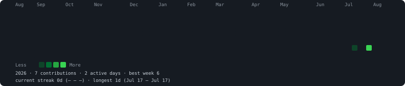

## Hi there 👋

<!--
**thisisausername67/thisisausername67** is a ✨ _special_ ✨ repository because its `README.md` (this file) appears on your GitHub profile.

Here are some ideas to get you started:

- 🔭 I’m currently working on ...
- 🌱 I’m currently learning ...
- 👯 I’m looking to collaborate on ...
- 🤔 I’m looking for help with ...
- 💬 Ask me about ...
- 📫 How to reach me: ...
- 😄 Pronouns: ...
- ⚡ Fun fact: ...
-->


<!-- HEATMAP:START -->

### thisisausername67's Contribution Heatmap



<details>
<summary>ASCII version (click to expand)</summary>

```
    Aug   Sep     Oct     Nov       Dec     Jan     Feb     Mar       Apr     May       Jun     Jul     Aug   
Mon                                                                                                           
                                                                                                              
Wed                                                                                                           
                                                                                                              
Fri                                                                                                           
                                                                                                  ░   █       
                                                                                                              

Less   ░ ▒ ▓ █ More
```

</details>

**2026** &nbsp;·&nbsp; 7 contributions &nbsp;·&nbsp; 2 active days &nbsp;·&nbsp; best week 6

current streak **0d** (— – —) &nbsp;·&nbsp; longest **1d** (Jul 17 – Jul 17)

Busiest day: 2026-07-31 (6 contributions)

_Last updated: 2026-08-20 03:57 UTC_

<!-- HEATMAP:END -->
